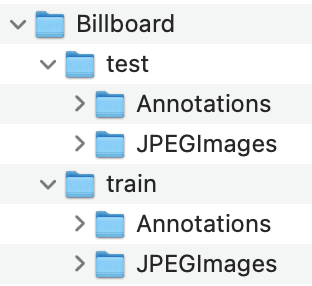

# LSTMVAEF_dataset
## dataset description

---

- We collect the magazine pages from *Billboard* and label it follow the rule that:
  - Elements in every page will be reordered by position from top to bottom, left to right. 
  - When elements overlap, they will be reordered from bottom to top.
- We collect 246 pages from two issues of *Billboard*, we split it with 80 pages for training and 166 for test.
- Due to potential copyright issues, we publish a few samples and our email address here. Who need the dataset can contact us by email.
  - Samples:
    
    
  - Dataset
    
    We split the dataset as 80 for train and 166 for test. For each part we would provide the jpg file and corresponding xml file. The annotations follow the rule of PascalVOC, but only the \<name\> and \<bndbox\> in \<object\> is meaningful.
    
    
  - Email:hjaptx@163.com
